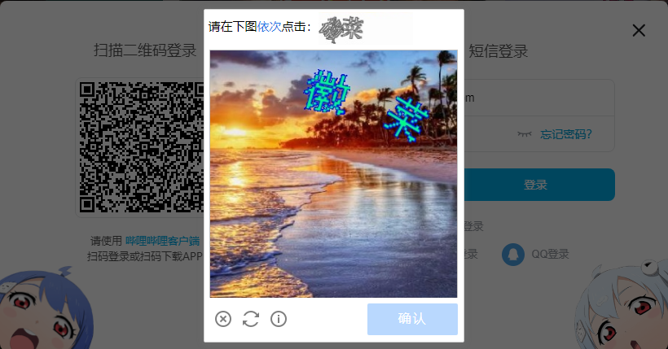
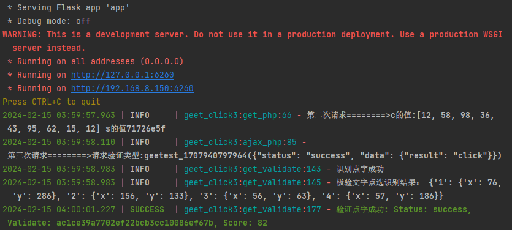
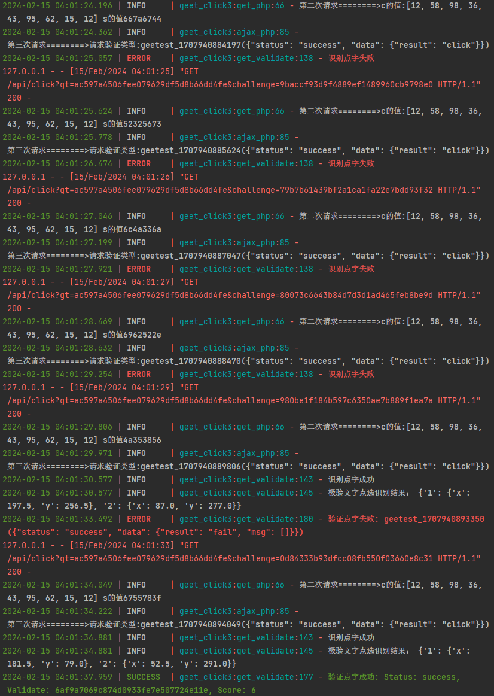

# bilibili_geetestV3_click

geetest（极验三代）点字验证JS逆向，可用于哔哩哔哩登录




## 概览

本文档概述了用于执行与Geetest点击验证码验证和SMS验证代码检索相关操作的API端点。它包括有关请求方法、所需参数和预期响应的详细信息。

## Endpoints

### 1. 点击验证码验证

#### 1.1 请求地址

- **GET/POST** `/api/click`

#### 1.2 参数列表

| 参数名      | 必须  | 类型   | 描述                                                               |
|------------|------|--------|-------------------------------------------------------------------|
| `gt`       | 是    | 字符串 | 点字验证码的标识符。                                            |
| `challenge`| 是    | 字符串 | 点字验证码的标识符，必须为32个字符长度。                               |
| `ocr_url`  | 否    | 字符串 | 打码OCR平台URL。                                      |
| `token`    | 否    | 字符串 | 打码OCR平台认证令牌。                                             |

注：若提交的参数不包含ocr_url或token，则调用内置ddddocr进行验证码识别（成功率较低）

#### 1.3 返回内容

- **成功响应：**

  ```json
  {
    "data": {
      "result": "",
      "score": "",
      "validate": "",
      "gt": "",
      "challenge": ""
    }
  }
  ```

  例：
  
    ```json
  {
    "data": {
      "result": "success",
      "score": "46",
      "validate": "434b26bd019127f3506215fca976c0f2",
      "gt": "ad597a4506fee079619df5d8b66da4fe",
      "challenge": "adfca1be34184ba72e9cf4df6c1efae7"
    }
  }
  ```

- **错误响应：**

  ```json
  {
    "error": "错误消息"
  }
  ```

### 2. 服务端接收SMS验证代码

#### 2.1 请求地址

- **POST** `/api/sms`

#### 2.2 参数列表

此端点期望一个包含以下结构的JSON载荷：

| 键名     | 必须  | 类型   | 描述                                  |
|---------|------|--------|--------------------------------------|
| `SMSRB` | 是    | 字符串 | 包含代码的SMS的内容。                  |

#### 2.3 返回内容

- **成功响应：**

  ```json
  {
    "status": "OK"
  }
  ```

- **错误响应：**

  ```json
  {
    "error": "JSON数据无效，请检查是否包含短信内容SMSRB"
  }
  ```

### 3. 获取SMS验证代码

#### 3.1 请求地址

- **GET** `/api/get_validation_code`

#### 3.2 参数列表

None

#### 3.3 返回内容

- **响应：**

  ```json
  {
    "validation_code": "提取的验证代码"
  }
  ```

### 4. 重置服务端SMS验证代码缓存

#### 4.1 请求地址

- **GET** `/api/reset_validation_code`

#### 4.2 参数列表

None

#### 4.3 返回内容

- **响应：**

  ```json
  {
    "status": "OK"
  }
  ```
## 演示

### 1. 调用打码平台OCR识别点字坐标

成功率达到99%,且score较高



### 2. 调用ddddocr库识别点字坐标

适用于验证码有3个汉字及以下，这种情况下成功率也较低。

所以调用ddddocr的时候，推荐通过反复注册验证码来刷到2个汉字的点选验证码图片


